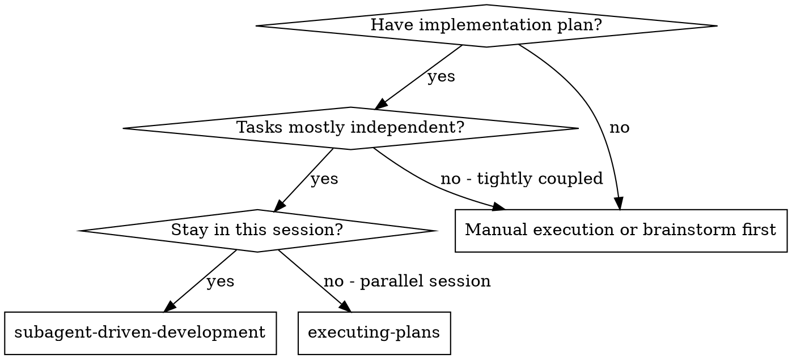
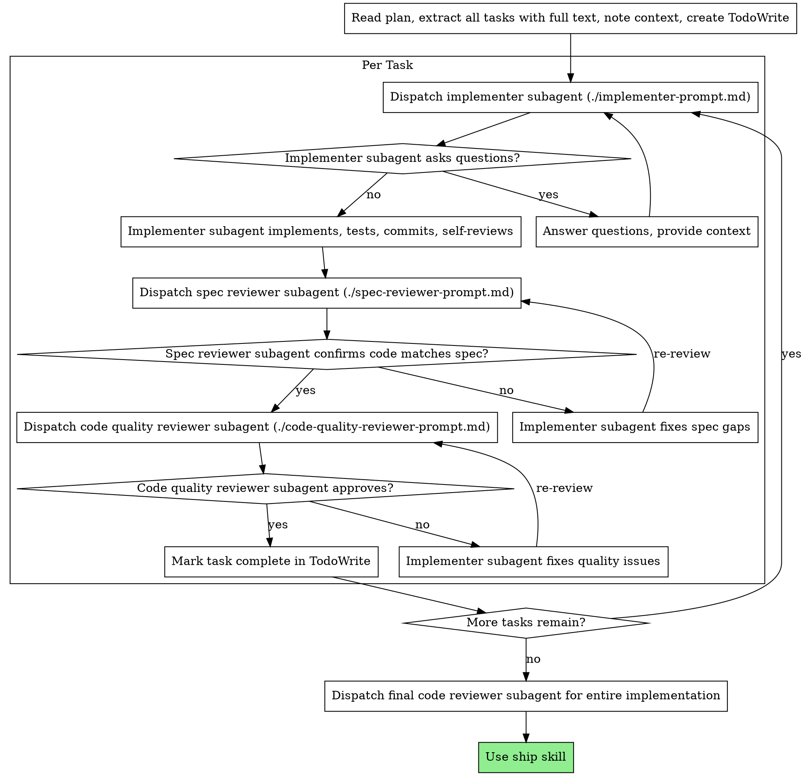

# Subagent-Driven Development

Dispatch fresh subagent per task + two-stage review (spec compliance, then code quality).

**Principle:** Fresh context per task + reviews = high quality, fast iteration

## When to Use



**vs. Executing Plans (parallel session):**
Same session, fresh subagent per task, two-stage review, no human-in-loop between tasks

## The Process



## Prompt Templates

- `./implementer-prompt.md` - Dispatch implementer subagent
- `./spec-reviewer-prompt.md` - Dispatch spec compliance reviewer subagent
- `./code-quality-reviewer-prompt.md` - Dispatch code quality reviewer subagent

## Example Workflow

```
You: I'm using Subagent-Driven Development to execute this plan.

[Read plan file once: docs/plans/feature-plan.md]
[Extract all 5 tasks with full text and context]
[Create TodoWrite with all tasks]

Task 1: Hook installation script

[Get Task 1 text and context (already extracted)]
[Dispatch implementation subagent with full task text + context]

Implementer: "Before I begin - should the hook be installed at user or system level?"

You: "User level (~/.config/superpowers/hooks/)"

Implementer: "Got it. Implementing now..."
[Later] Implementer:
  - Implemented install-hook command
  - Added tests, 5/5 passing
  - Self-review: Found I missed --force flag, added it
  - Committed

[Dispatch spec compliance reviewer]
Spec reviewer: ✅ Spec compliant - all requirements met, nothing extra

[Get git SHAs, dispatch code quality reviewer]
Code reviewer: Strengths: Good test coverage, clean. Issues: None. Approved.

[Mark Task 1 complete]

Task 2: Recovery modes

[Get Task 2 text and context (already extracted)]
[Dispatch implementation subagent with full task text + context]

Implementer: [No questions, proceeds]
Implementer:
  - Added verify/repair modes
  - 8/8 tests passing
  - Self-review: All good
  - Committed

[Dispatch spec compliance reviewer]
Spec reviewer: ❌ Issues:
  - Missing: Progress reporting (spec says "report every 100 items")
  - Extra: Added --json flag (not requested)

[Implementer fixes issues]
Implementer: Removed --json flag, added progress reporting

[Spec reviewer reviews again]
Spec reviewer: ✅ Spec compliant now

[Dispatch code quality reviewer]
Code reviewer: Strengths: Solid. Issues (Important): Magic number (100)

[Implementer fixes]
Implementer: Extracted PROGRESS_INTERVAL constant

[Code reviewer reviews again]
Code reviewer: ✅ Approved

[Mark Task 2 complete]

...

[After all tasks]
[Dispatch final code-reviewer]
Final reviewer: All requirements met, ready to merge

Done!
```

## Advantages vs Alternatives

| vs Manual | vs Executing Plans | Efficiency |
|-----------|-------------------|-----------|
| TDD natural | Same session | No file read overhead |
| Fresh context per task | No handoff | Controller curates context |
| Parallel-safe | Continuous progress | Full info upfront |
| Can ask questions | Automatic reviews | Questions before work |

**Quality gates:** Self-review → spec compliance → code quality → re-review loops

**Cost:** More subagents (implementer + 2 reviewers) + prep work, but catches issues early

## Red Flags

| Never | Reason |
|-------|--------|
| Skip reviews | Quality gates required |
| Proceed with unfixed issues | Not done |
| Parallel implementer subagents | Conflicts |
| Subagent reads plan file | Provide full text instead |
| Skip scene-setting context | Subagent needs understanding |
| Ignore subagent questions | Answer before proceeding |
| "Close enough" on spec | Not acceptable |
| Skip review loops | Re-review required |
| Self-review replaces actual review | Both needed |
| Code quality before spec ✅ | Wrong order |

**Subagent questions:** Answer clearly, provide context, don't rush

**Reviewer finds issues:** Same subagent fixes → reviewer re-checks → repeat until approved

**Task fails:** Dispatch fix subagent with specific instructions (don't fix manually)

## Integration

**Required skills:** writing-plans (creates plan), receiving-code-review (reviewer template), ship (post-tasks)

**Subagent use:** test-driven-development (TDD per task)

**Alternative:** executing-plans (parallel session)
