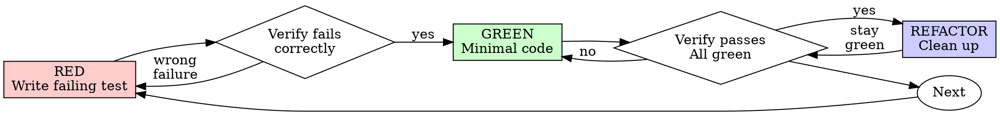

# Test-Driven Development (TDD)

## Overview

Write the test first. Watch it fail. Write minimal code to pass.

**Core principle:** If you didn't watch the test fail, you don't know if it tests the right thing.

## When to Use

**Always:** New features, bug fixes, refactoring, behavior changes

**Exceptions (ask your human partner):** Throwaway prototypes, generated code, configuration files

## The Iron Law

```
NO PRODUCTION CODE WITHOUT A FAILING TEST FIRST
```

Write code before the test? Delete it. Start over. No exceptions.

## Red-Green-Refactor Cycle



### RED - Write Failing Test

One minimal test showing desired behavior.

**Good:** One behavior, clear name, real code (no unnecessary mocks)

**Bad:** Generic name, over-mocked, tests mock not behavior

Example:
```typescript
test('retries failed operations 3 times', async () => {
  let attempts = 0;
  const operation = () => {
    attempts++;
    if (attempts < 3) throw new Error('fail');
    return 'success';
  };
  const result = await retryOperation(operation);
  expect(result).toBe('success');
  expect(attempts).toBe(3);
});
```

### Verify RED

**MANDATORY. Never skip.**

Run test: `npm test path/to/test.test.ts`

Confirm test **fails** (not errors) because feature is missing, not typos.

- **Test passes?** You're testing existing behavior. Fix the test.
- **Test errors?** Fix error, re-run until it fails correctly.

### GREEN - Minimal Code

Simplest code to pass the test. No extra features, no refactoring unrelated code, no over-engineering.

```typescript
async function retryOperation<T>(fn: () => Promise<T>): Promise<T> {
  for (let i = 0; i < 3; i++) {
    try {
      return await fn();
    } catch (e) {
      if (i === 2) throw e;
    }
  }
  throw new Error('unreachable');
}
```

### Verify GREEN

**MANDATORY.**

Run test: `npm test path/to/test.test.ts`

Confirm test passes, other tests still pass, no errors/warnings.

- **Test fails?** Fix code, not test.
- **Other tests fail?** Fix now.

### REFACTOR - Clean Up

After green only: Remove duplication, improve names, extract helpers. Keep tests green. Don't add behavior.

### Repeat

Next failing test for next feature.

## Good Tests

| Quality | Good | Bad |
|---------|------|-----|
| **Minimal** | One thing. "and" in name? Split it. | `test('validates email and domain and whitespace')` |
| **Clear** | Name describes behavior | `test('test1')` |
| **Shows intent** | Demonstrates desired API | Obscures what code should do |

## Why Order Matters

Tests written after code pass immediately. Passing immediately proves nothing: might test wrong thing, test implementation not behavior, miss edge cases, or never see it catch bugs. Test-first forces you to see failure first, proving it actually tests something.

## Rationalizations vs. Reality

| Excuse | Reality | Action |
|--------|---------|--------|
| "Too simple to test" | Simple code breaks. Test takes 30 seconds. | Write test. |
| "I'll test after" | Tests passing immediately prove nothing. | Test-first only. |
| "Tests after achieve same goals" | Tests-after verify "what does this do?" Tests-first discover "what should this do?" | Delete code, start with TDD. |
| "Already manually tested" | Ad-hoc ≠ systematic. No record, can't re-run. | Automate with tests. |
| "Deleting X hours is wasteful" | Sunk cost fallacy. Keeping unverified code is technical debt. | Delete and rewrite. |
| "Keep as reference, write tests first" | You'll adapt it. That's testing after. | Delete means delete. |
| "Need to explore first" | Fine. Throw away exploration, start with TDD. | Start fresh. |
| "Test hard = design unclear" | Hard to test = hard to use. Listen to test. | Simplify design. |
| "TDD will slow me down" | TDD faster than debugging. Pragmatic = test-first. | Commit to TDD. |
| "Manual test faster" | Manual doesn't prove edge cases. Re-testing every change is slower. | Automate. |
| "Existing code has no tests" | You're improving it. Add characterization tests. | Test before changing. |
| "Code before test — just this once" | STOP. This is rationalization. | Delete. Start over. |
| "It's about spirit not ritual" | STOP. Failing test first is the core. | Delete. Start over. |
| "This is different because..." | STOP. No exceptions. | Delete. Start over. |

## Example: Bug Fix

**Bug:** Empty email accepted

**RED**
```typescript
test('rejects empty email', async () => {
  const result = await submitForm({ email: '' });
  expect(result.error).toBe('Email required');
});
```

**Verify RED:** `FAIL: expected 'Email required', got undefined`

**GREEN**
```typescript
function submitForm(data: FormData) {
  if (!data.email?.trim()) {
    return { error: 'Email required' };
  }
  // ...
}
```

**Verify GREEN:** `PASS`

**REFACTOR:** Extract validation if needed.

## When Stuck

| Block | Solution |
|-------|----------|
| Don't know how to test | Write wished-for API, assertion first |
| Test too complicated | Design too complicated, simplify interface |
| Must mock everything | Code too coupled, use dependency injection |
| Test setup huge | Extract helpers, simplify design |

## Debugging Integration

Bug found? Write failing test reproducing it. Follow TDD cycle. Test proves fix and prevents regression.

Never fix bugs without a test.

## Testing Anti-Patterns

When adding mocks or test utilities, read @testing-anti-patterns.md to avoid:
- Testing mock behavior instead of real behavior
- Adding test-only methods to production classes
- Mocking without understanding dependencies

## Verification Checklist

- [ ] Every new function/method has a test
- [ ] Watched each test fail before implementing
- [ ] Each test failed for expected reason (feature missing, not typo)
- [ ] Wrote minimal code to pass each test
- [ ] All tests pass
- [ ] Output pristine (no errors, warnings)
- [ ] Tests use real code (mocks only if unavoidable)
- [ ] Edge cases and errors covered

Can't check all boxes? You skipped TDD. Start over.

## Worked Example

**Adding `calculateDiscount(cart)` function with 10% off for $100+, 20% off for $250+:**

**RED — Failing test:**
```typescript
test('applies 10% discount for cart totaling $150', () => {
  const cart = { items: [{ price: 150 }] };
  expect(calculateDiscount(cart)).toBe(15);
});
```
Run: `FAIL — calculateDiscount is not defined`

**GREEN — Minimal implementation:**
```typescript
function calculateDiscount(cart: Cart): number {
  const total = cart.items.reduce((sum, i) => sum + i.price, 0);
  if (total > 100) return total * 0.1;
  return 0;
}
```
Run: `PASS`

**RED again — Next behavior:**
```typescript
test('applies 20% discount for cart totaling $300', () => {
  const cart = { items: [{ price: 300 }] };
  expect(calculateDiscount(cart)).toBe(60);
});
```
Run: `FAIL — expected 60, got 30`

**GREEN — Extend:**
```typescript
if (total > 250) return total * 0.2;
if (total > 100) return total * 0.1;
return 0;
```
Run: Both pass. **REFACTOR** if needed.

Test-first forces design from the caller's perspective before implementation exists, preventing awkward interfaces that leak implementation details.

## Decision Framework

| Situation | Action |
|-----------|--------|
| Code lacks tests | Write tests BEFORE changes (characterization tests) |
| Test fails from behavior change | Update test expectations |
| Test fails from brittleness | Refactor test, mock less |
| Test fails from actual bug | Report bug, don't "fix" test |
| Unsure what to test | Test PUBLIC interface, not internals |
| Test is slow (>1s) | Check for real I/O; mock external deps only |

## Verification Gate

Before claiming work is complete, run the gate function — no claims without fresh evidence.

```
BEFORE claiming any status:
1. IDENTIFY: What command proves this claim?
2. RUN: Execute the FULL command (fresh, complete)
3. READ: Full output, check exit code, count failures
4. VERIFY: Does output confirm the claim?
5. ONLY THEN: Make the claim
```

**Verification Report:**
```
Build:     [PASS/FAIL/SKIP]
Types:     [PASS/FAIL/SKIP]
Tests:     [PASS/FAIL/SKIP] (X/Y passed)
Security:  [PASS/FAIL/SKIP]
Diff:      X files changed, +Y/-Z lines
Overall:   [READY/NOT READY]
```

**Self-Critique Before Done:**
1. Did I implement ALL requirements, or skip something hard?
2. Could my changes break anything? Blast radius?
3. Edge cases: empty, null, max, concurrent, unicode?
4. If every external call fails, does the code handle it?
5. Does my code follow surrounding patterns?
6. Is there a simpler way?

If ANY answer is uncertain → investigate before declaring done.

**Red flags — STOP:** Using "should", "probably", "seems to" · Expressing satisfaction before verification · About to commit without fresh test output · Trusting agent success reports without checking VCS diff.

## Final Rule

```
Production code → test exists and failed first
Otherwise → not TDD
```

No exceptions without your human partner's permission.
