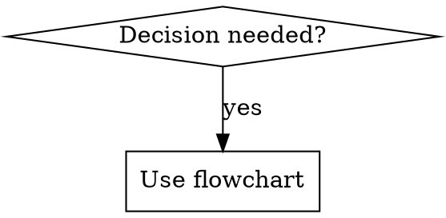

# Writing Skills

**Writing skills IS Test-Driven Development applied to process documentation.**

Personal skills live in `~/.claude/skills/` (Claude Code) or `~/.codex/skills/` (Codex).

**Core principle:** If you didn't watch an agent fail without the skill, you don't know if the skill teaches the right thing.

**REQUIRED BACKGROUND:** Understand `superpowers:test-driven-development` before using this skill. This skill adapts TDD to documentation.

## What is a Skill?

| Type | Definition |
|------|-----------|
| **Skills are** | Reusable techniques, patterns, tools, reference guides |
| **Skills are NOT** | One-off solutions, narratives, project-specific conventions |
| **Create when** | Technique wasn't obvious, you'd reference it again, applies broadly, others benefit |

## TDD Mapping for Skills

| TDD Concept | Skill Creation |
|-------------|----------------|
| Test case | Pressure scenario with subagent |
| Production code | Skill document (SKILL.md) |
| RED | Agent violates rule without skill (baseline) |
| GREEN | Agent complies with skill present |
| REFACTOR | Close loopholes while maintaining compliance |

## Skill Types

- **Technique:** Concrete method with steps (condition-based-waiting, root-cause-tracing)
- **Pattern:** Way of thinking about problems (flatten-with-flags, test-invariants)
- **Reference:** API docs, syntax guides, tool documentation (office-docs)

## Directory Structure

```
skills/
  skill-name/
    SKILL.md           # Main reference (required)
    supporting-file.*  # Only if needed: reusable tools, heavy reference
```

Flat namespace — all skills searchable. Move to separate files only for: (1) heavy reference (100+ lines), (2) reusable tools. Keep inline: principles, code patterns (<50 lines), everything else.

## SKILL.md Structure

**Frontmatter (YAML only):**
```yaml
name: Skill-Name-With-Hyphens
description: Use when [specific triggering conditions]
```

**Body sections:**
1. Overview — what is this? (1-2 sentences)
2. When to Use — symptoms, use cases, when NOT to use
3. Core Pattern (techniques/patterns) — before/after comparison
4. Quick Reference — table/bullets for scanning
5. Implementation — inline code or link to file
6. Common Mistakes — what goes wrong + fixes

**Constraints:**
- name: letters, numbers, hyphens only (no parentheses)
- description: max 500 chars, third-person, start with "Use when..."
- NEVER summarize workflow in description (see CSO section)

## Claude Search Optimization (CSO)

### Description = Triggering Conditions ONLY

**CRITICAL:** Do NOT summarize the skill's workflow. When descriptions summarize workflow, Claude may follow the description instead of reading the full skill.

Example: Description saying "code review between tasks" caused Claude to do ONE review, even though the skill showed TWO. Changed to "Use when executing implementation plans with independent tasks" — Claude then correctly followed the flowchart.

**Good descriptions:**
- ✅ "Use when executing implementation plans with independent tasks in the current session"
- ✅ "Use when implementing any feature or bugfix, before writing implementation code"

**Bad descriptions:**
- ❌ "Use when executing plans - dispatches subagent per task with code review between" (summarizes workflow)
- ❌ "Use for TDD - write test first, watch it fail, write minimal code" (too much process)

**Content rules:**
- Use concrete triggers, symptoms, situations
- Describe problem (race conditions) not language symptoms (setTimeout)
- Third-person, technology-agnostic (unless skill is tech-specific)
- NEVER describe the process or workflow

### Keyword Coverage

Use words Claude would search for:
- Error messages: "Hook timed out", "ENOTEMPTY"
- Symptoms: "flaky", "hanging", "zombie", "pollution"
- Synonyms: "timeout/hang", "cleanup/teardown"
- Tools: command names, library names, file types

### Naming Convention

**Verb-first, active voice:**
- ✅ `creating-skills` not `skill-creation`
- ✅ `condition-based-waiting` not `async-test-helpers`
- ✅ `flatten-with-flags` not `data-structure-refactoring`

Gerunds (-ing) work well: `creating-skills`, `testing-skills`, `debugging-with-logs`

### Token Efficiency

**Word count targets:**
- getting-started workflows: <150 words
- Frequently-loaded skills: <200 words total
- Other skills: <500 words

**Techniques:**
- Move details to tool help: reference `--help` instead of listing flags
- Use cross-references: "Always use [other-skill-name]" instead of repeating
- Compress examples: 20 words, not 42
- Eliminate redundancy: don't repeat cross-referenced content

### Cross-Referencing Other Skills

Use skill name only with explicit markers:
- ✅ `**REQUIRED SUB-SKILL:** Use superpowers:test-driven-development`
- ✅ `**REQUIRED BACKGROUND:** You MUST understand superpowers:systematic-debugging`
- ❌ Avoid `@skills/path/SKILL.md` (@-syntax force-loads files, burns context)

## Flowcharts

Use ONLY for:
- Non-obvious decision points
- Process loops where you might stop too early
- "When to use A vs B" decisions

NEVER use for reference material, code examples, linear instructions, or unlabeled steps.

Example (Graphviz):


Render with: `./render-graphs.js ../skill-dir`

## Code Examples

**One excellent example beats many mediocre ones.**

Choose most relevant language (TypeScript for testing, Shell/Python for system debugging, Python for data).

**Good example:**
- Complete and runnable
- Well-commented explaining WHY
- From real scenario
- Shows pattern clearly
- Ready to adapt (not fill-in-blank)

**Don't:** Implement in 5+ languages, create templates, write contrived examples.

## The Iron Law

```
NO SKILL WITHOUT A FAILING TEST FIRST
```

Applies to NEW skills AND edits to existing skills.

Write skill before testing? Delete it. Start over. No exceptions:
- Not for "simple additions"
- Not for "just adding a section"
- Not "documentation updates"
- Don't keep untested changes
- Don't "adapt" while testing

See `superpowers:test-driven-development` — same principles apply to documentation.

## Testing by Skill Type

### Discipline-Enforcing Skills (TDD, test-driven-development)
- Test with academic questions, pressure scenarios, combined pressures
- Success: Agent follows rule under maximum pressure

### Technique Skills (condition-based-waiting, root-cause-tracing)
- Test with application scenarios, variation/edge cases, missing info
- Success: Agent applies technique correctly to new scenarios

### Pattern Skills (reducing-complexity, information-hiding)
- Test with recognition, application, counter-examples
- Success: Agent identifies when/how to apply pattern

### Reference Skills (API docs, command references)
- Test with retrieval, application, gap testing
- Success: Agent finds and applies information correctly

## Bulletproofing Against Rationalization

### Close Every Loophole Explicitly

❌ Bad: "Write code before test? Delete it."

✅ Good:
```
Write code before test? Delete it. Start over.
**No exceptions:**
- Don't keep it as "reference"
- Don't "adapt" it while testing
- Don't look at it
```

### Build Rationalization Table

Capture excuses from baseline testing:

| Excuse | Reality |
|--------|---------|
| "Simple code breaks" | Test takes 30 seconds |
| "I'll test after" | Tests-after: what does this do? Tests-first: what should? |
| "Too simple to test" | Simple code breaks. Always test. |

### Create Red Flags List

```markdown
## Red Flags — STOP and Start Over
- Code before test
- "I already manually tested"
- "Tests after achieve same purpose"
- "It's about spirit not ritual"
- "This is different because..."

All mean: Delete code. Start over.
```

## RED-GREEN-REFACTOR for Skills

### RED: Write Failing Test
Run pressure scenario with subagent WITHOUT skill. Document:
- What choices did they make?
- What rationalizations did they use (verbatim)?
- Which pressures triggered violations?

### GREEN: Write Minimal Skill
Write skill addressing those specific rationalizations (no hypothetical cases).
Run same scenarios WITH skill. Agent should now comply.

### REFACTOR: Close Loopholes
Agent found new rationalization? Add explicit counter. Re-test until bulletproof.

See `testing-skills-with-subagents.md` for complete methodology.

## Eval Loop

### Step 1: Write Test Prompts

**Triggering prompts (3-5):**
```
"Refactor UserService to reduce complexity" → code-refactoring
"Clean up this 200-line legacy function" → code-refactoring
"processOrder has cyclomatic complexity 15" → code-refactoring
```

**Non-triggering prompts (3-5):**
```
"Add endpoint for user registration" → backend-endpoint
"Fix bug in login flow" → systematic-debugging
"Write tests for payment module" → test-driven-development
```

### Step 2: Test Activation

Run subagent with skill available. Score:
- Trigger hit rate: X/5 prompts correctly activated skill
- False positive rate: X/5 non-triggering prompts incorrectly activated

**Target:** ≥80% trigger hit rate, ≤20% false positive rate.

### Step 3: Test Output Quality

Evaluate: Did agent follow workflow? Use patterns? Produce useful output?

### Step 4: Iterate

- Hit rate <80% → improve description keywords, add trigger conditions
- False positives >20% → add "When NOT to use", narrow description
- Poor output → improve skill body, better examples

## Description Optimizer

### Process
1. Start with current description
2. Run 5 triggering + 5 non-triggering prompts
3. Score precision and recall
4. Adjust and re-test

### Optimization Patterns

**Low recall (misses real uses):**
- Add synonyms: "refactor, clean up, simplify, reduce complexity"
- Add symptoms: "long methods, deep nesting, duplicated code"

**Low precision (false positives):**
- Add exclusions: "NOT for adding features or fixing bugs"
- Narrow scope: "Use when cleaning up *existing* code"
- Remove generic terms overlapping other skills

**Example:**
```yaml
# v1: Low recall
description: Use when refactoring code to improve structure.

# v2: Better recall
description: Use when refactoring, cleaning up, or simplifying code without changing behavior.

# v3: High precision
description: Use when cleaning up legacy code, reducing complexity, eliminating duplication. NOT for adding features or fixing bugs.
```

## Anti-Patterns

| Pattern | Why Bad |
|---------|---------|
| Narrative storytelling | Too specific, not reusable |
| Multi-language examples | Mediocre quality, maintenance burden |
| Code in flowcharts | Can't copy-paste, hard to read |
| Generic labels (step1, helper2) | No semantic meaning |

## Skill Creation Checklist (TDD Adapted)

**RED Phase:**
- [ ] Create 3+ pressure scenarios (combined for discipline skills)
- [ ] Run WITHOUT skill — document baseline verbatim
- [ ] Identify rationalization patterns

**GREEN Phase:**
- [ ] name: letters, numbers, hyphens only
- [ ] description: <500 chars, "Use when...", third-person, no workflow summary
- [ ] keywords throughout (errors, symptoms, tools)
- [ ] Clear overview, core principle
- [ ] Address specific baseline failures
- [ ] Code inline OR link to separate file
- [ ] One excellent example (not multi-language)
- [ ] Run scenarios WITH skill — verify compliance

**REFACTOR Phase:**
- [ ] Find NEW rationalizations from testing
- [ ] Add explicit counters (discipline skills)
- [ ] Build rationalization table from all iterations
- [ ] Create red flags list
- [ ] Re-test until bulletproof

**Quality Checks:**
- [ ] Small flowchart only if non-obvious decision
- [ ] Quick reference table
- [ ] Common mistakes section
- [ ] No narrative storytelling
- [ ] Supporting files only for tools/heavy reference

**Deployment:**
- [ ] Commit to git and push to fork (if configured)
- [ ] Consider PR if broadly useful

## Discovery Workflow

How future Claude finds your skill:
1. Encounters problem ("tests are flaky")
2. Finds SKILL (description matches)
3. Scans overview (relevant?)
4. Reads patterns (quick reference table)
5. Loads example (when implementing)

Optimize for this flow — put searchable terms early and often.

## Advanced: Orchestrator Pattern

Chain multiple skills into a pipeline with a single master skill. Instead of prompting each skill manually, one orchestrator coordinates the sequence.

**Example:** A `dev-pipeline` skill that commits changes then regenerates the changelog:

```markdown
---
name: dev-pipeline
description: Use when completing implementation work and need to commit changes plus update changelog in one step
allowed-tools: Read, Write, Bash
---

# Dev Pipeline

## Overview
Chains commit workflow and changelog generation — eliminates manual skill invocation between related tasks.

## Steps
1. Run the `smart-commit` skill to stage and commit all current changes.
2. Run the `changelog-automation` skill to regenerate CHANGELOG.md.
3. Print a summary showing the new commit hash and updated changelog path.
```

**Rules for orchestrators:**
- Keep orchestrators thin — logic lives in the child skills
- Description must cover the combined intent (triggers on "commit and update changelog")
- Each child skill must be independently testable
- Orchestrators can chain 2-5 skills; beyond that, use a workflow

**When to use:** Repetitive multi-step processes where the sequence is always the same. If the sequence varies based on context, use a workflow (`/workflow`) instead.

## Writing Concrete Steps

Steps must be executable, not aspirational:

| Bad | Good |
|-----|------|
| "Understand the project structure" | "Run `ls -la` to list root directory files" |
| "Analyze the git history" | "Run `git log --pretty=format:\"%h %s (%cr)\" --reverse`" |
| "Check for issues" | "Run `npm test` and report any failures" |

Every step should produce observable output that confirms it ran correctly.

## The Bottom Line

Creating skills IS TDD for process documentation.

Same Iron Law: No skill without failing test first.
Same cycle: RED (baseline) → GREEN (write skill) → REFACTOR (close loopholes).
Same benefits: Better quality, fewer surprises, bulletproof results.

If you follow TDD for code, follow it for skills.
